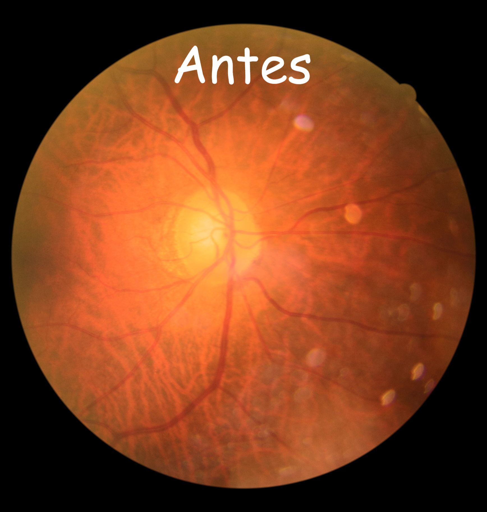
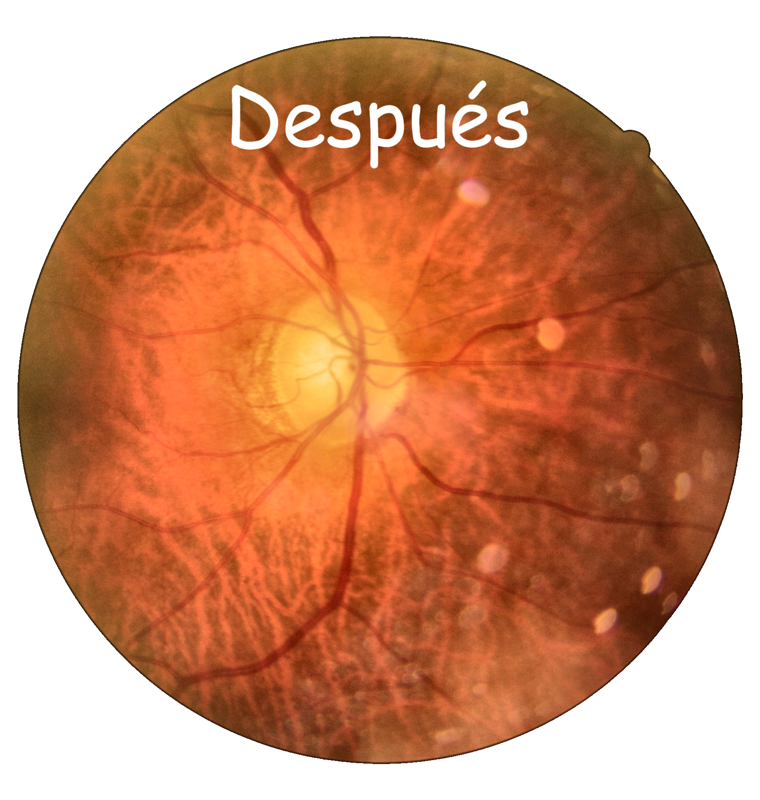

# Procesador de Imágenes de Fondo de Ojo

[](https://opensource.org/licenses/MIT)
[](https://www.python.org/downloads/)
[](https://opencv.org/)

## 🔍 Descripción

Una herramienta robusta de código abierto para el preprocesamiento de imágenes oftalmológicas de fondo de ojo. Esta solución permite mejorar automáticamente la calidad visual de imágenes retinianas mientras elimina el fondo negro no deseado, generando imágenes con transparencia que preservan los colores originales de la retina.

Ideal para investigadores, desarrolladores de IA y profesionales de la salud visual que trabajan en el análisis automatizado de patologías retinianas.

## ✨ Características principales

- **Eliminación inteligente de fondos**: Genera imágenes con fondo transparente de alta calidad
- **Preservación precisa del color**: Mantiene los colores naturales de la retina sin distorsiones
- **Mejora adaptativa del contraste**: Implementa CLAHE optimizado para resaltar estructuras retinianas
- **Eliminación de artefactos**: Detecta y elimina automáticamente textos y marcas indeseadas
- **Procesamiento por lotes**: Maneja grandes conjuntos de datos con estructura de directorios anidados
- **Compatibilidad con datasets**: Diseñado para trabajar con conjuntos de datos estándar de retinopatía diabética

## 📋 Requisitos

```
python >= 3.7
opencv-python >= 4.5.0
numpy >= 1.19.0
pandas >= 1.1.0
tqdm >= 4.50.0
matplotlib >= 3.3.0
```

## 🚀 Instalación

```bash
# Clonar el repositorio
git clone https://github.com/tu-usuario/fundus_image_preprocessor.git
cd fundus_image_preprocessor

# Crear un entorno virtual (opcional pero recomendado)
python -m venv venv
source venv/bin/activate  # En Windows use: venv\Scripts\activate
```

## 💻 Uso

### Procesamiento por lotes

```python
# Procesar un conjunto de datos organizado
batch_process_images(
    base_dir='ruta/a/dataset_original',
    output_base_dir='ruta/a/dataset_procesado'
)
```

### Estructura de directorios esperada

```
dataset_original/
├── TRAIN/
│   ├── 0/
│   │   └── (imágenes de fondo de ojo sin patología)
│   └── 1/
│       └── (imágenes de fondo de ojo con patología)
├── TEST/
│   ├── 0/
│   └── 1/
└── VAL/
    ├── 0/
    └── 1/
```

## 📊 Ejemplos de resultados

<table>
  <tr>
    <th>Imagen Original</th>
    <th>Imagen Procesada</th>
  </tr>
  <tr>
    <td></td>
    <td></td>
  </tr>
</table>

## 🔧 Personalización

Puedes ajustar los parámetros del procesamiento modificando los valores en `preserve_color_enhancement()`:

```python
# Aumentar el contraste
clahe = cv2.createCLAHE(clipLimit=2.0, tileGridSize=(8, 8))

# Procesamiento más suave
clahe = cv2.createCLAHE(clipLimit=1.2, tileGridSize=(6, 6))
```

## 🧪 Aplicaciones

- Entrenamiento de modelos de deep learning para detección de retinopatía diabética
- Segmentación automatizada de vasos sanguíneos retinianos
- Análisis de cambios en la mácula y nervio óptico
- Creación de datasets aumentados para investigación oftalmológica
- Visualización mejorada para educación médica

## 🤝 Contribuciones

Las contribuciones son bienvenidas y apreciadas. Si deseas colaborar:

1. Haz fork del repositorio
2. Crea una rama para tu feature (`git checkout -b feature/nueva-funcionalidad`)
3. Realiza tus cambios y haz commit (`git commit -m 'Añadir nueva funcionalidad'`)
4. Envía un push a tu rama (`git push origin feature/nueva-funcionalidad`)
5. Abre un Pull Request

## 📄 Licencia

Este proyecto está bajo la Licencia MIT - consulta el archivo [LICENSE](LICENSE) para más detalles.

## 📚 Citar este trabajo

Si utilizas este código en tu investigación, por favor cítalo:

```
@software{fundus_image_preprocessor,
  author = {Misrael Florentino Altamirano},
  title = {Procesador de Imágenes de Fondo de Ojo},
  year = {2025},
  url = {https://github.com/misraelDev/fundus_image_preprocessor}
}
```

## 📧 Contacto

- **Nombre:** Misrael Florentino Altamirano
- **Email:** misraelaltamirano@gmail.com
- **LinkedIn:** [Misrael Florentino Altamirano](https://linkedin.com/in/misraelflorentino/)